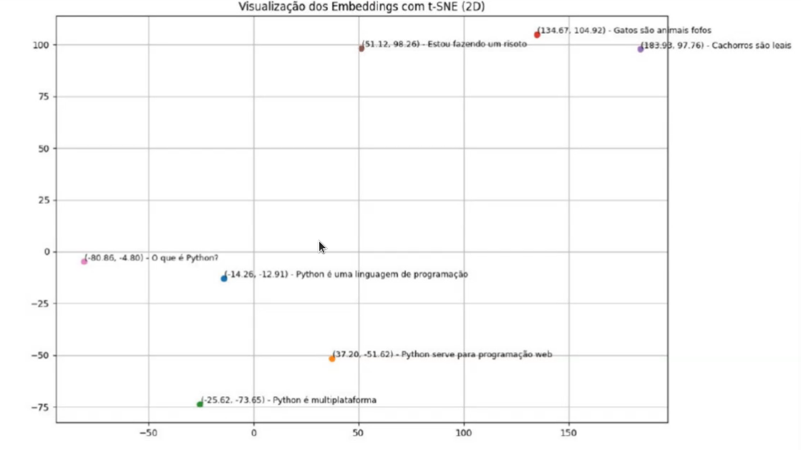

# Arcane - Workshop de programação web + IA

## Sobre o workshop

O **Arcane** é um workshop prático de dois dias focado em desenvolvimento web com Python/Django e integração de IA usando LangChain. Ao longo do workshop, você vai construir um sistema real com agentes inteligentes, RAG (Retrieval-Augmented Generation) e chat em tempo real, usando o projeto **PetCare** como base.

## Tecnologias usadas

- **Python** - linguagem principal do back-end. Escolhemos Python pelo seu ecossistema maduro de bibliotecas de IA (LangChain, OpenAI SDK, etc.) e pela facilidade de prototipagem rápida.
- **Django** - framework web que cuida das rotas, banco de dados, autenticação e templates. É a espinha dorsal do projeto PetCare.

## Cronograma

### Dia 1

- **Projeto PetCare** - apresentação do sistema que vamos construir ao longo do workshop
- **Teoria - Como funciona a criação de RAGs** - entender chunks, embeddings e recuperação semântica
- **Prática - Treinamento de agentes de IA com base de dados real** - alimentar o vetor store com dados do PetCare
- **Prática - Config geral do projeto** - setup do Django + LangChain + variáveis de ambiente
- **Prática - Agente de triagem e resumo / interpretação** - primeiro agente funcional
- **Prática - Assistente de IA** - chatbot integrado ao sistema

### Dia 2

- **Back-end - Chat em tempo real com IA** - WebSockets com Django Channels
- **Front-end - Chat em tempo real com IA** - interface de chat com JavaScript
- **Ver fontes** - como o agente cita as fontes do RAG
- **Secretária autônoma + Google Calendar** - agente com ferramentas externas e integração de calendário

## Agentes de IA vs Modelos LLM

Para entender o que vamos construir, é importante distinguir um simples modelo LLM de um agente de IA.

### Modelo LLM puro

Um LLM (Large Language Model) é um modelo que recebe texto e devolve texto. Sem memória, sem acesso a sistemas externos. Cada chamada começa do zero.

```
User |Prompt| -> LLM -> Resposta
```

### Agente de IA

Um agente é um LLM com "superpoderes": memória de conversas anteriores e integrações com sistemas externos.

```
User |Prompt| -> LLM -> Resposta

                |    |
            Memória  Integração
```

- **Memória** - o agente se lembra do que foi dito antes na conversa (ou até em conversas anteriores, dependendo da configuração)
- **Integração** - o agente pode chamar APIs, consultar bancos de dados, buscar na web, criar eventos no calendário, etc.

> Um agente transforma o LLM de um gerador de texto em um colaborador que age sobre o mundo real.

### LangChain

LangChain é o framework que conecta tudo isso. Ele fornece as peças para construir aplicações com LLMs de forma estruturada e modular.

**Modelos de IA suportados**

LangChain tem abstrações prontas para os principais modelos do mercado - você pode trocar de modelo sem reescrever a lógica da aplicação:

- OpenAI (GPT-4, GPT-4o...)
- Grok (xAI)
- Claude (Anthropic)
- Gemini (Google)

**Componentes principais**

| Componente           | O que faz                                                   |
| -------------------- | ----------------------------------------------------------- |
| **Prompt Templates** | Define estruturas de prompt reutilizáveis com variáveis     |
| **Output Parsers**   | Formata a saída do modelo (JSON, lista, objeto...)          |
| **Observabilidade**  | Tracing e logs de cada chamada ao modelo via LangSmith      |
| **Chains**           | Encadeia etapas: prompt -> modelo -> parser -> próxima ação |
| **Memory**           | Armazena e recupera o histórico de conversas                |

**Para RAG e múltiplos agentes**

- **Múltiplos Agentes** - orquestra vários agentes especializados (ex: um agente de triagem + um agente de resposta)
- **Embeddings** - converte texto em vetores numéricos para busca semântica
- **Document Loaders** - carrega documentos (PDF, TXT, banco de dados...) para alimentar o RAG

## O que é RAG

RAG (Retrieval-Augmented Generation) é a técnica que permite que o modelo responda com base em **documentos específicos da sua aplicação**, sem precisar ser retreinado.

O fluxo geral é:

```
Documento -> Chunks -> Embeddings -> Vector Store
                                          |
User |Pergunta| -> Embedding -> Busca Semântica -> Chunks relevantes -> LLM -> Resposta
```

### Chunks

**Por que dividir em chunks?**

Enviar um documento inteiro (ex: a Constituição Federal) em um único prompt tornaria o prompt gigante e as respostas menos precisas. A solução é dividir o texto em pedaços menores chamados **chunks**.

- `chunk_size` define quantos caracteres cada trecho terá
- **Exemplo:** Constituição com 64.488 palavras + `chunk_size = 100` gera cerca de 645 mini-arquivos

### Overlap

**O problema dos chunks isolados**

Ao cortar o texto em pedaços, frases importantes podem ser separadas e perder o sentido:

```
Chunk A: "...O réu tem direito à ampla"
Chunk B: "defesa e ao contraditório..."
```

Sem overlap, o contexto se perde na fronteira entre os chunks.

**Solução: `chunk_overlap`**

Define quantos caracteres de sobreposição existem entre um chunk e o próximo, preservando o contexto entre os pedaços.

```
chunk_size = 500
chunk_overlap = 100

Chunk 1: [000 ... 499]
Chunk 2: [400 ... 899]  <- reutiliza 100 chars do Chunk 1
Chunk 3: [800 ... 1299] <- reutiliza 100 chars do Chunk 2
```

**Exemplo com palavras** (`chunk_size = 7`, `chunk_overlap = 3`):

- Chunk 1: `Python é uma excelente linguagem de programação`
- Chunk 2: `linguagem de programação para Web e IA`

Os últimos 3 termos do Chunk 1 se repetem no início do Chunk 2, mantendo a continuidade.

### Embeddings

Depois de dividir em chunks, o sistema precisa saber **quais chunks são relevantes** para a pergunta do usuário. É aqui que entram os embeddings.

**O que são embeddings?**

Embeddings transformam textos em **vetores numéricos** - listas de números que representam o significado semântico do conteúdo. Frases com significado parecido ficam próximas matematicamente.

```json
{
  "texto": "O que é Python?",
  "vetor_parcial": [
    -0.007813546806573868, 0.007350319996476173, 0.01180547196418047,
    -0.017262011766433716, 0.019986875355243683, 0.026335809379816055,
    0.005541691556572914, 0.006291029509156942, 0.0043563758954405785,
    -0.018951427191495895
  ]
}
```

**Exemplo conceitual:** mesmo com palavras diferentes, essas três frases terão embeddings próximos porque expressam a mesma intenção:

- `"O que é Python?"`
- `"Me explique Python"`
- `"Como funciona Python?"`



**Como o RAG usa embeddings na prática:**

1. O usuário faz uma pergunta
2. A pergunta é convertida em embedding
3. O sistema compara com os embeddings dos chunks armazenados (similaridade semântica)
4. Recupera os chunks mais relevantes
5. Injeta esses chunks como contexto no prompt do LLM

```python
messages = [
    {
        "role": "system",
        "content": (
            "Você é uma assistente de IA, use o contexto para responder "
            "as perguntas. Contexto: Python é uma linguagem de programação - "
            "Python serve para programação web, Python é multiplataforma"
        )
    },
    {
        "role": "user",
        "content": "O que é Python"
    }
]
```

### Resumo

| Conceito          | O que faz                                                         |
| ----------------- | ----------------------------------------------------------------- |
| **Chunking**      | Quebra o documento em pedaços menores                             |
| **Chunk overlap** | Preserva contexto entre pedaços consecutivos                      |
| **Embeddings**    | Encontra os pedaços mais relevantes semanticamente                |
| **RAG**           | Usa esses pedaços como contexto para o LLM responder com precisão |
